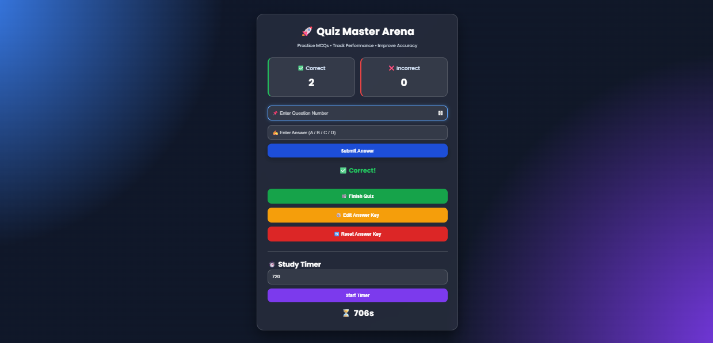
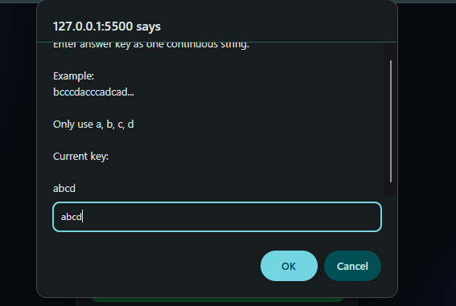
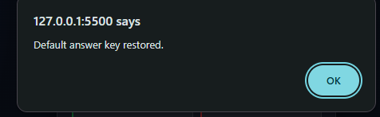
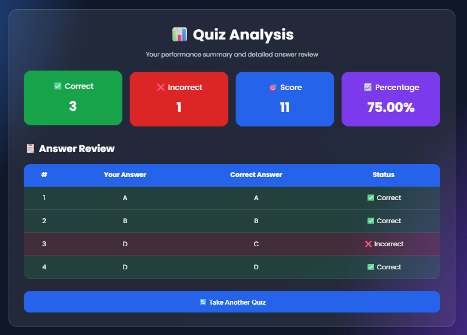

# 🚀 Quiz Master Arena

A modern web-based MCQ answer checker with customizable answer keys, detailed performance analysis, study timer, and a clean responsive interface.

Designed for students preparing for competitive exams like **JEE, NEET, GATE, UPSC, SSC**, and other objective examinations.

## 🌐 Live Demo

*Coming Soon (Will be deployed on Vercel)*

---

## ✨ Features

### 📝 Answer Evaluation

- Enter Question Number
- Submit Answer (A / B / C / D)
- Instant Correct / Incorrect Feedback
- Prevent Duplicate Attempts
- Correct Answer Reveal
- Streak Tracking

---

### 📊 Performance Analysis

After finishing the quiz, the application generates a complete report including:

- ✅ Correct Answers
- ❌ Incorrect Answers
- 🎯 Accuracy
- 📈 Percentage
- 🏆 Score (+4 / -1)
- 📋 Detailed Answer Review

---

### 🔑 Custom Answer Key

Users can:

- Edit the complete answer key
- Save it automatically using Local Storage
- Reset to the default answer key anytime

No code modification is required for different question papers.

---

### ⏱️ Study Timer

- Custom Countdown Timer
- Audio Alert
- Restart Anytime

---

### 🎨 Modern UI

- Glassmorphism Design
- Responsive Layout
- Smooth Animations
- Gradient Background
- Interactive Buttons

---

## 🛠 Tech Stack

- HTML5
- CSS3
- JavaScript
- Local Storage

---

## 📷 Screenshots

### 🏠 Home



---

### ⚙️ Edit Answer Key



---

### 🔄 Reset Answer Key



---

### 📊 Result Analysis



---

## 📂 Project Structure

```text
quiz-master-arena/
│
├── assets/
│   ├── home.png
│   ├── edit-answer-key.png
│   ├── reset-answer-key.png
│   └── results.png
│
├── index.html
├── result.html
├── style.css
├── script.js
└── README.md
```

---

## 📄 License

This project is licensed under the MIT License.

---

## 👨‍💻 Author

**Aman Kumar**

B.Tech Electrical Engineering  
Indian Institute of Technology Mandi (2026–2030)

🔗 **GitHub:** https://github.com/kuaman-student

💼 **LinkedIn:** https://www.linkedin.com/in/aman-kumar-a94464418/

---
If you have any suggestions or feedback, feel free to open an issue.

⭐ If you found this repository useful, consider giving it a star!
